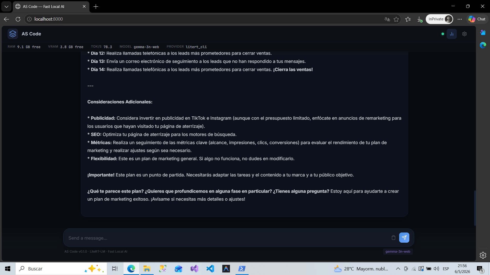

# AS Code

**By Alpha Software**

AS Code is a lightweight, general-purpose local AI runtime designed for speed and simplicity on modest hardware. It provides a robust, Windows-optimized environment to run large language models locally with minimal overhead, a browser-first chat experience, and an OpenAI-compatible API.

> **AS Code is NOT just for coding.** It is a personal AI platform for ideas, productivity, planning, writing, local experimentation — and now, document-aware conversations.

## Current Status

AS Code is currently in an active development stage, evolving from a local chat server into an extensible **Unified Smart Main Agent Runtime** (offline-first, modular, and hardware-optimized alternative to Claude Code, Cursor, or NotebookLM on Windows).

Core architecture and **Phases 1, 2 & 3** are fully completed:
- **Phase 1 (Core & RAG NotebookLM):** LiteRT-LM Windows inference (GPU accelerated), OpenAI-compatible API, dynamic capability registry, skill prompt injection, and hybrid semantic/keyword retrieval vector pipeline.
- **Phase 2 (Working Memory Layer):** Runtime-native CRUD memory tables (variables, tasks with priority, observations), session-based isolation (`session_id`), cognitive prompt injection in system prompt, and event-driven UI panel.
- **Phase 3 (Smart Main Agent Foundation):** Unified Runtime Coordinator managing memory limits, deterministic workflow state transitions (`objective`, `phase`, `focus`), automatic task progression, and skill suggestions with UI badges and chips. Also includes **Output Stream Stabilization** (stdout line-filtering to remove CLI initialization logs) and **Backend Parameter Presets** (`PRECISE`, `BALANCED`, `CREATIVE`) matching active runtime pipelines.

Current focus (Phase 3.5):
- **Phase 3.5 (Agent Control Loop):** Server-side agent loops, native execution protocol parsing (`capability.execute()`), and cognitive prompt tuning.

## 🚀 Key Features

*   **LiteRT-LM Runtime:** Ultra-optimized inference engine for Windows hardware.
*   **Hardware-Adaptive Profiles:** Auto-tunes settings (such as models and VRAM limits) to match your system's specs.
*   **Browser-First UI:** Premium, minimal browser interface with direct document drop zone.
*   **OpenAI-Compatible API:** Serve as a backend for VS Code extensions (Cline, Continue, etc.).
*   **RAG NotebookLM (RAG v2):** Multi-stage local pipeline: parses, chunks (AST-aware), generates local embeddings, stores metadata in SQLite + vectors in FAISS, and executes hybrid retrieval.
*   **Working Memory Layer (Phase 2):** Persistent, session-aware short-term memory (variables, prioritizable tasks, observation provenance tracking) injected dynamically at the SYSTEM level.
*   **Structured Context Builder:** Composes retrieval context dynamically by grouping chunks under `## CONTEXT FROM DOCUMENTS` by file and section.
*   **Low-Overhead Hot-Swapping:** Intelligent model loading and idle timeout unloads.

## 📸 Screenshots

### Local AI Chat



### Features shown
- Multi-model routing
- GPU acceleration
- Local inference
- Real-time streaming
- Browser-based UI
- Document upload panel

## 💻 Hardware Philosophy

AS Code is built for "Real Hardware"—the laptops and desktops people actually own. While a dedicated GPU is recommended for the best experience, our architecture is designed to remain responsive even on mid-range systems.

- **Optimized for:** Windows 10/11
- **Focus:** Maximum performance per watt/GB.

## 🏗 Architecture Summary

AS Code uses a modular architecture built on top of FastAPI and LiteRT-LM. It acts as an intelligent routing and execution layer for local models, abstracting away the complexity of VRAM management and hardware-specific configurations, while exposing a standard OpenAI-compatible REST API.

Document context injection is handled as a thin layer between the API and the engine — zero changes to inference infrastructure.

## 🛠 Installation

### Prerequisites
- Windows 10/11
- PowerShell
- Python 3.10+
- `litert-lm` CLI installed via `uv`:
  ```powershell
  uv tool install litert-lm
  ```
- (Optional but recommended) Compatible GPU drivers

### Setup

Clone the repository and run the setup script:

```powershell
git clone https://github.com/alphasoftwarepy/as-code.git
cd as-code
.\scripts\install.ps1
```

The install script will:
1. Create and activate a Python virtual environment
2. Install all dependencies (`pip install -r requirements.txt`)
3. Create required directories (`models/gemma/`, `uploads/`, `logs/`, `cache/`)
4. Copy `.env.example` → `.env` with sensible defaults
5. Detect GPU availability and set the appropriate backend

### Python Dependencies

The full dependency list is in `requirements.txt`. Key packages:

| Package | Purpose |
|---|---|
| `fastapi`, `uvicorn` | API server |
| `pydantic`, `pydantic-settings` | Config & models |
| `pypdf` | PDF parsing (document upload) |
| `python-docx` | DOCX parsing (document upload) |
| `psutil` | System monitoring |
| `pyyaml` | Config file parsing |
| `httpx` | HTTP client |
| `sqlalchemy` | SQLite persistence (RAG metadata) |
| `sentence-transformers` | Local embeddings — BAAI/bge-small-en-v1.5 (RAG v2) |
| `faiss-cpu` | Vector search index (RAG v2) |
| `rank-bm25` | Keyword retrieval for hybrid RAG (RAG v2) |
| `numpy` | Embedding array operations (RAG v2) |

To install manually:
```powershell
pip install -r requirements.txt
```

## 🧠 Manual Model Setup (Important)

AS Code uses a **Role-Based Architecture**. The internal logic doesn't care about specific model names, only about the role the model plays.

| Role           | Purpose                                      | Model File (LiteRT-LM) |
|----------------|----------------------------------------------|------------------------|
| **Chat**       | General conversation and planning            | `gemma-3n-E2B-it-int4.litertlm` |
| **Code**       | Technical tasks and programming              | `gemma-3n-E2B-it-int4.litertlm` |
| **Reasoning**  | Deep analysis and complex architecture       | `gemma-3n-E2B-it-int4.litertlm` |

> [!IMPORTANT]
> The current engine is ultra-optimized for the **`.litertlm`** (LiteRT-LM) format. You can swap models in `config.yaml`, but ensure they follow this specific encoding for maximum performance on Windows hardware.

**Setup steps:**

1. Create the directory: `models\gemma\`
2. Download the `.litertlm` file from [HuggingFace — litert-community](https://huggingface.co/google/gemma-3n-E2B-it-litert-lm).
3. Place it at: `models\gemma\gemma-3n-E2B-it-int4.litertlm`
4. Run the server — the runtime detects and registers the roles automatically.

## 🏃‍♂️ Running the Project

Start the local server using the provided script:

```powershell
.\scripts\run.ps1
```

This will activate the environment, start the FastAPI server, and output logs cleanly.

Once running, open your browser at `http://localhost:8000`.

## 📄 Document Upload (RAG)

AS Code supports uploading documents to chat with their contents. This works entirely locally — no cloud involved.

### Supported formats
- **TXT** — plain text files
- **PDF** — text-based PDFs (not scanned images)
- **DOCX** — Microsoft Word documents

### How to use
1. Open the browser UI at `http://localhost:8000`
2. Drag a file into the **Documentos** panel at the bottom, or click **+ Subir**
3. Once uploaded, all subsequent messages in the session will include the document's content as context
4. Click **🗑 Limpiar** to remove documents from the session

### API (for external clients)

```http
POST /api/documents/session          → Create a session, returns session_id
POST /api/documents/upload?session_id=<id>  → Upload a file (multipart/form-data)
GET  /api/documents/<session_id>     → List documents in session
DELETE /api/documents/<session_id>   → Clear session
```

Include `X-Document-Session-Id: <session_id>` as a header in your `/v1/chat/completions` requests to activate context injection.

## 🧠 RAG NotebookLM Pipeline (v2)

AS Code includes a full vector-search RAG pipeline for deeper, more precise document-aware conversations. It runs 100% locally — no cloud, no API keys required.

### Activation

Add to your `.env`:
```
ASCODE_ENABLE_RAG_MODE=true
```

### What it does differently from RAG v1

| | RAG v1 | RAG v2 |
|---|---|---|
| Storage | In-memory sessions | SQLite (persistent) |
| Retrieval | Full text injection | FAISS vector search + BM25 hybrid |
| Context | Truncated raw text | Hierarchy-aware grouped context |
| Code files | ❌ | ✅ AST chunking by function/class |
| Relevance | None | Cosine similarity score per chunk |

### Supported file types & chunking strategy

| Format | Strategy |
|---|---|
| `.py` | AST — by function/class boundaries with symbol metadata |
| `.md`, `.rst` | By heading hierarchy (`#`, `##`, …) with adaptive fallback |
| `.js`, `.ts`, `.go`, etc. | By function/class (regex) |
| `.pdf`, `.txt`, `.docx` | Structure-agnostic adaptive semantic (paragraph → sentence → char fallback) |

### Upload a document

```bash
# Chat pipeline (documents, notes, PDFs)
curl -X POST http://localhost:8000/api/rag/documents/upload \
  -F "file=@README.md" -F "pipeline=chat"

# Code pipeline (source files)
curl -X POST http://localhost:8000/api/rag/documents/upload \
  -F "file=@api/engine.py" -F "pipeline=code"
```

### Chat with RAG context

```bash
curl -X POST http://localhost:8000/v1/chat/completions \
  -H "X-Enable-RAG: true" \
  -H "X-Mode: normal" \
  -H "X-Pipeline: chat" \
  -H "Content-Type: application/json" \
  -d '{"messages":[{"role":"user","content":"Explain GPU fallback"}],"model":"auto"}'
```

**Request headers:**

| Header | Values | Default |
|---|---|---|
| `X-Enable-RAG` | `true` / `false` | `true` when RAG enabled globally |
| `X-Mode` | `normal` / `thinking` / `code` | `normal` |
| `X-Pipeline` | `chat` / `code` | `chat` |


## 🔌 API Endpoints

Once running, the API is available at `http://localhost:8000`.

| Endpoint | Method | Description |
|---|---|---|
| `/` | GET | Serves the browser UI |
| `/health` | GET | Health check |
| `/v1/chat/completions` | POST | OpenAI-compatible chat (streaming + non-streaming) |
| `/v1/models` | GET | List available local models |
| `/v1/status` | GET | System status (hardware, VRAM, provider) |
| `/v1/cancel` | POST | Cancel in-progress generation |
| `/v1/providers` | GET | List registered inference providers |
| `/api/rag/documents/upload` | POST | Upload & ingest document (NotebookLM RAG) |
| `/api/rag/documents` | GET | List RAG documents with chunk counts |
| `/api/rag/documents/{id}` | DELETE | Delete document + chunks + physical files + vectors |
| `/api/rag/retrieve` | POST | Debug: raw chunk retrieval |
| `/api/rag/context` | POST | Debug: preview NotebookLM context |
| `/docs` | GET | Interactive API docs (Swagger) |
| `/v1/capabilities` | GET | Retrieve dynamic runtime capabilities status |
| `/v1/memory` | GET | Get working memory snapshot (variables, tasks, observations) |
| `/v1/memory/variables` | POST/DELETE | CRUD variables in working memory |
| `/v1/memory/tasks` | POST/PATCH/DELETE | CRUD tasks in working memory (status, priority, title) |
| `/v1/memory/observations` | POST/DELETE | CRUD observations with source provenance |
| `/v1/memory/reset` | POST | Clear all working memory for the session |
| `/api/documents/*` | * | *(Deprecated)* Legacy session-based document endpoints |

## 🧠 Runtime Capabilities

AS Code is designed to be hardware-aware, provider-aware, and runtime-modular. Functionalities are not hardcoded; instead, they are dynamically discovered and evaluated lazily using the **Runtime Capability System**. 

The UI queries `GET /v1/capabilities` to render controls dynamically rather than displaying inactive or fake features.

Each capability is returned with metadata, category, and security scopes:
```json
{
  "terminal": {
    "id": "terminal",
    "name": "Terminal Execution",
    "description": "Run terminal commands and shell processes directly on host system",
    "category": "developer",
    "version": "1.0.0",
    "available": true,
    "enabled": false,
    "provider": "powershell",
    "status": "offline",
    "reason": "Disabled for security reasons. Can be enabled via capability overrides.",
    "scopes": ["terminal.execute"]
  }
}
```

Capabilities are organized by categories (`core`, `documents`, `tools`, `multimodal`, `developer`, `network`) and define explicit security `scopes` which future Skills will consume. Users can explicitly enable/disable capabilities globally via the `capability_overrides` dictionary setting.

## 🔌 VSCode / Cline Compatibility

AS Code exposes an OpenAI-compatible API, making it fully compatible with VSCode extensions like Cline. Simply configure your extension to use an OpenAI-compatible provider with the base URL pointing to `http://localhost:8000/v1` and any dummy API key.

## 🗺 Roadmap Overview

- **Completed (Phase 1):** LiteRT core runtime, GPU acceleration, OpenAI API, minimal browser UI, **NotebookLM RAG Pipeline**, and Dynamic Capability System (registry, safety overrides).
- **Completed (Phase 2):** **Working Memory Layer** (SQLite persistent tables, session_id isolation, API endpoints, system prompt injection, and event-driven UI drawer).
- **In Progress (Phase 3):** **Smart Main Agent** (server-side agent loops, XML/JSON capability call parsing, cognitive prompting).
- **Upcoming (Phase 4 & 5):** Capability Execution (`capability.execute()`), HITL confirmation queues.
- **Future (Phase 6 to 8):** VSCode/IDE integration, marketplace, and Claude/MCP Translation Layer.

## 🤝 Contributing

Contributions are welcome! Please see [CONTRIBUTING.md](CONTRIBUTING.md) for guidelines.

## 💖 Support the Project

If AS Code helps you, consider supporting development.

Your support helps improve:

* LiteRT Windows optimization
* Local AI infrastructure
* VSCode/Cline integration
* Performance optimization
* RAG and document intelligence
* Future autonomous systems

### Crypto Donations

USDT (TRC20)

```text
TADArdWELAAQMVtufWzcfF3R2yNPnyRfXr
```

IMPORTANT:
Please send only USDT using the TRON (TRC20) network.

Thank you for supporting open local AI infrastructure development.

— AS Code / Alpha Software

## 📄 License

This project is licensed under the Apache 2.0 License - see the [LICENSE](LICENSE) file for details. Commercial use, modification, and redistribution are allowed. Attribution to Alpha Software is required.
